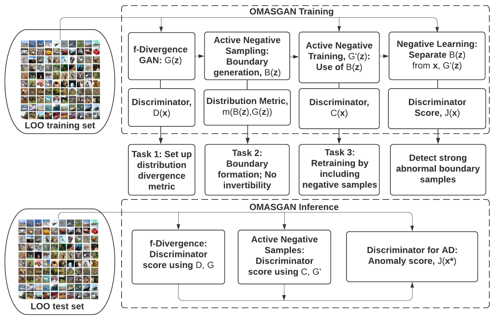

# OMASGAN: Out-of-Distribution Minimum Anomaly Score GAN for Sample Generation on the Boundary
Out-of-Distribution Minimum Anomaly Score GAN (OMASGAN)

Code Repository for 'OMASGAN: Out-of-Distribution Minimum Anomaly Score GAN for Sample Generation on the Boundary'

## Abstract of Paper:
Deep generative models trained in an unsupervised manner encounter the problem of setting high likelihood and low reconstruction loss to Out-of-Distribution (OoD) samples. This increases the Type II errors (false negatives, misses of anomalies) and decreases the Anomaly Detection (AD) performance. Also, deep generative models for AD suffer from the rarity of anomalies. To address these limitations, we propose a new model to perform active negative sampling and training. Our OoD Minimum Anomaly Score GAN (OMASGAN) uses data only from the normal class. Our model generates samples on the boundary of the support of the data distribution. These boundary samples are abnormal data and we perform retraining for AD using normal and the generated minimum-anomaly-score OoD samples. We can use any f-divergence distribution metric. Likelihood and invertibility are not needed. We use a discriminator for inference and the evaluation of OMASGAN on images using the leave-one-out methodology shows that it outperforms state-of-the-art benchmarks. Using the Area Under the Receiver Operating Characteristics curve (AUROC), OMASGAN yields an improvement of at least 0.24 and 0.07 points on average on MNIST and CIFAR-10 respectively over recent benchmarks.

Flowchart Diagram:

Figure 1: Flowchart of the OMASGAN model for AD which generates minimum-anomaly-score OoD samples on the boundary of the data distribution and subsequently uses these generated boundary samples to train a discriminative model for detecting abnormal data.

Figure 2: Training of the OMASGAN model for AD in images using active negative sampling and training by creating strong abnormal samples.

Figure 3: Illustration of the OMASGAN algorithm for AD where **x**~p**x**, G(**z**)~pg, and G'(**z**)~pg'. The figure shows the OMASGAN Tasks and the data distribution, p**x**, the data model distribution, pg, the data model distribution after retraining, pg', and the samples from the boundary of the support of the data distribution, B(**z**)~pb.

Future Date: Saturday 8 May 2021: Author Notification: Make the Code Repository non-anonymous, release the source code, and make the source code public.

Date: Friday 22 January 2021: Creation of the Simulations Experiments folder for the Tasks of OMASGAN, including the Boundary Task and the Retraining Task. In the boundary algorithm (Task 2), the boundary model is trained to perform sample generation on the boundary of the data distribution by starting from within the data distribution (Task 1). In the retraining function (Task 3), as shown in the flowchart diagram, OMASGAN performs model retraining by including negative samples, where the negative samples are generated by our negative data augmentation methodology. Regarding our negative data augmentation methodology, OMASGAN generates minimum anomaly score OoD samples around the data using a strictly decreasing function of a distribution metric between the boundary samples and the data.

In the Simulations Experiments folder, for the Boundary and Retraining Tasks, according to Table 4 of the f-GAN paper, we use the Pearson Chi-Squared f-divergence distribution metric and we note that after Pearson Chi-Squared, the next best are KL and then Jensen-Shannon.

Example usage: "cd ./Simulations_Experiments/" and then "python train_Task1_fGAN_Simulation_Experiment.py", "python -m train_Task1_fGAN_Simulation_Experiment", "python Task1_MNIST_fGAN_Simulation_Experiment.py", or "python Task1_MNIST2_fGAN_Simulation_Experiment.py"

Also: Example usage: "cd ./Simulations_Experiments/Task1_CIFAR10_MNIST_KLWGAN_Simulation_Experiment/" and then "python train_Task1_KLWGAN_Simulation_Experiment.py --shuffle --batch_size 64 --parallel --num_G_accumulations 1 --num_D_accumulations 1 --num_epochs 500 --num_D_steps 4 --G_lr 2e-4 --D_lr 2e-4 --dataset C10 --data_root ./data/ --G_ortho 0.0 --G_attn 0 --D_attn 0 --G_init N02 --D_init N02 --ema --use_ema --ema_start 1000 --start_eval 50 --test_every 5000 --save_every 2000 --num_best_copies 5 --num_save_copies 2 --loss_type kl_5 --seed 2 --which_best FID --model BigGAN --experiment_name C10Ukl5"

The use of torch.nn.DataParallel(model) is recommended along with the use of torch.save(model.module.state_dict(), "./.pt") instead of torch.save(model.state_dict(), "./.pt"). Also, saving the best model is recommended by using "best_loss = float('inf')" and "if loss.item()<best_loss: best_loss=loss.item(); torch.save(model.module.state_dict(), "./.pt")".

After saving the trained model from Task 1: Example usage: "cd ./Simulations_Experiments/" and then "python train_Task2_fGAN_Simulation_Experiment.py".

Then, after saving the trained models from Tasks 1 and 2: Example usage: "cd ./Simulations_Experiments/" and then "python train_Task3_fGAN_Simulation_Experiment.py".

Next, after saving the trained models from Tasks 1, 2, and 3: Example usage: "cd ./Simulations_Experiments/" and then "python train_Task3_J_fGAN_Simulation_Experiment.py".

For the evaluation of the proposed OMASGAN model, we use the leave-one-out (LOO) evaluation methodology and the image data sets [MNIST](http://yann.lecun.com/exdb/mnist/) and [CIFAR-10](https://www.cs.toronto.edu/~kriz/cifar.html).

To run f-GAN-based OMASGAN training using the LOO methodology on MNIST data, for abnormal_class_LOO = 0 (train_Task1_fGAN_Simulation_Experiment.py), run “sh run_all_OMASGAN_Tasks.sh”.

This Code Repository contains a PyTorch implementation for the OMASGAN model.

Environments - Requirements: Python 3.7 and PyTorch 1.3

Project Website: [OMASGAN Project](https://anonymous.4open.science/r/2c122800-a538-4357-b452-a8d0e9a92bee/).

Acknowledgement: Thanks to the repositories: [PyTorch-Template](https://github.com/victoresque/pytorch-template "PyTorch Template"), [Generative Models](https://github.com/shayneobrien/generative-models/blob/master/src/f_gan.py), [f-GAN](https://github.com/nowozin/mlss2018-madrid-gan), and [KLWGAN](https://github.com/ermongroup/f-wgan/tree/master/image_generation)

Also, thanks to the repositories: [Negative-Data-Augmentation](https://anonymous.4open.science/r/99219ca9-ff6a-49e5-a525-c954080de8a7/), [Negative-Data-Augmentation-Paper](https://openreview.net/forum?id=Ovp8dvB8IBH), and [BigGAN](https://github.com/ajbrock/BigGAN-PyTorch)

Additional acknowledgement: Thanks to the repositories: [f-GAN](https://github.com/nowozin/mlss2018-madrid-gan/blob/master/GAN%20-%20CIFAR.ipynb), [GANs](https://github.com/shayneobrien/generative-models), [Boundary-GAN](https://github.com/wiseodd/generative-models/blob/master/GAN/boundary_seeking_gan/bgan_pytorch.py), [fGAN](https://github.com/wiseodd/generative-models/blob/master/GAN/f_gan/f_gan_pytorch.py), and [Rumi-GAN](https://github.com/DarthSid95/RumiGANs)

This website is best viewed in Chrome or Firefox.
